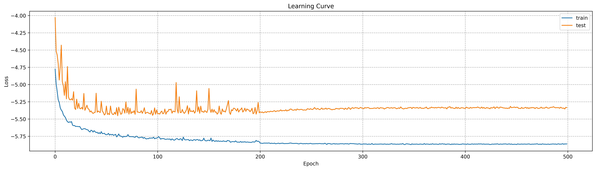
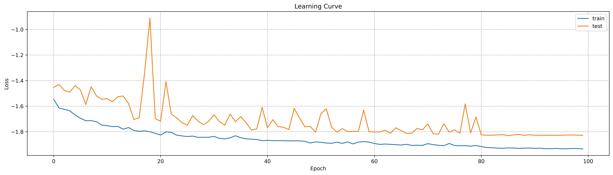
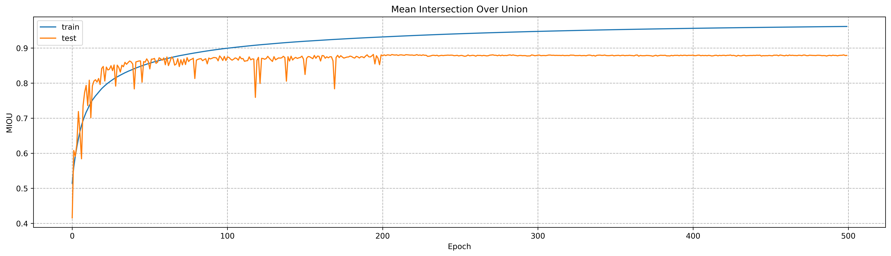
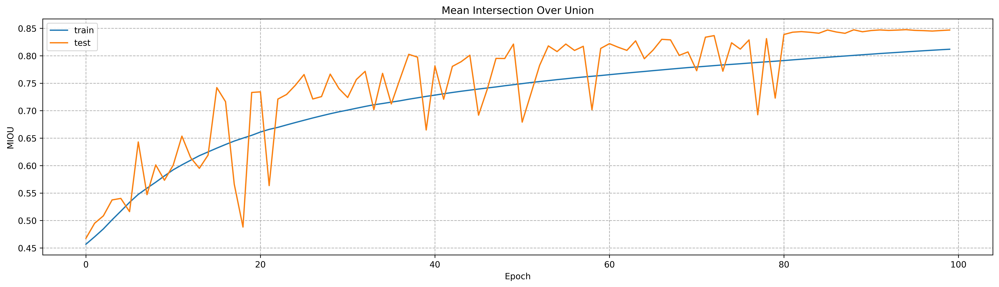
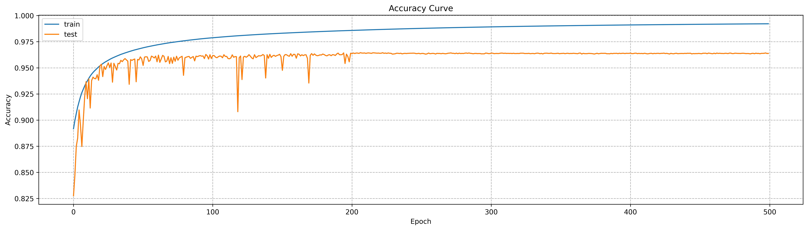
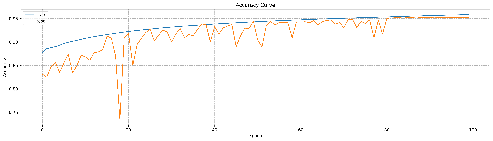

## UNet Family
In this program, I implemented three kind of models U-Net, UNet++ and UNet+++.
Detailed code about these models can be found at the folder of "./ModelNet."
Personally, from my experience achieving these algorithms, I think U-Net has the simplest structure than others no matter from perspectives of implementation or training cost.
-----
### Dataset
In our program, remote sensing images related to houses are used to train and predict. 
These images come from a finished competition and can be downloaded at the [link](https://aistudio.baidu.com/datasetdetail/69911).
The resolution of each remote sensing image is 512 * 512.

----
### Experimental Setting
All of these models were implemented based on open source including python 1.7 and pytorch 1.7.1. 
The service used to train these models is equipped with two Tesla T4 Gpus, each of which has 15G volume.
Limited by our server configuration, I have to balance training time with model parameters.
In order to achieve training process in a acceptable way, I have to resize raw picture to 256 * 256 and cut off last layer of both UNet++ and UNet+++ presenting in academic papers.
The whole dataset is split to train and test datasets in the ratio of 8 to 2. The detailed configuration files of model are presented at the folder "./config".
----

### Folder Structure
- config: It is the folder where stores model's configure file.
- Dataset: It is the folder where stores data processing file.
- ModelNet: It is the folder where stores model's algorithms from U-Net to UNet+++.
- MyLoss: Dice loss, focal loss and the combination of BCE loss and dice loss are stored in this folder.
- RSUnetTrainer.py: It is the file used to train U-Net model.
- RSUnetPPTrainer.py: It is the file used to train UNet++ model.
- RSUnet3PTrainer.py: It is the file used to train UNet+++ model.
---

### Experiments

#### Performance of different model

| Model |IOU| Accuracy |Total Epoch| AVG Training Time Per Epoch |
|:-----:|:---:|:--------:|:---:|:---------------------------:|
| U-Net |0.792|  0.961   |500|            95 s             |
|   UNet++|0.806|  0.964   |500|            135 s            |
|UNet+++|0.750|  0.953   |100|            185 s            |

#### Learning curve for different model
- UNet++

- UNet+++

#### IOU curve for different model
- UNet++

- UNet+++

#### Accuracy curve for different model
- UNet++

- UNet+++

#### Case study for different model

- UNet++

- UNet+++

---
### Reference
- [1] https://blog.csdn.net/TXK_Kevin/article/details/125114674

- [2] https://blog.csdn.net/yumaomi/article/details/124823392

- [3] https://blog.csdn.net/yjysunshine/article/details/125707704

- [4] Ronneberger, Olaf, Philipp Fischer, and Thomas Brox. "U-net: Convolutional networks for biomedical image segmentation." Medical Image Computing and Computer-Assisted Intervention–MICCAI 2015: 18th International Conference, Munich, Germany, October 5-9, 2015, Proceedings, Part III 18. Springer International Publishing, 2015.

- [5] Zhou, Zongwei, et al. "Unet++: Redesigning skip connections to exploit multiscale features in image segmentation." IEEE transactions on medical imaging 39.6 (2019): 1856-1867.

- [6] Huang, Huimin, et al. "Unet 3+: A full-scale connected unet for medical image segmentation." ICASSP 2020-2020 IEEE international conference on acoustics, speech and signal processing (ICASSP). IEEE, 2020.